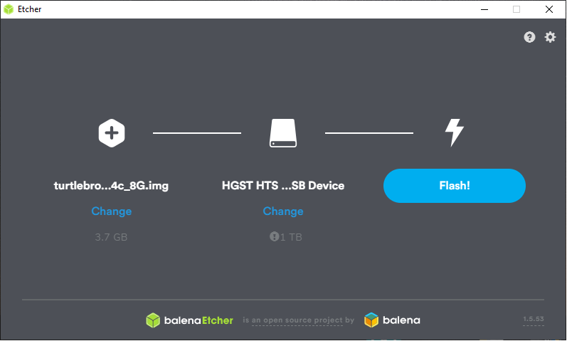

# RaspberryPi

Компьютеры Raspberry, идущие в комплекте с роботами, поставляются с предустановленными ОС  
`Raspberry Pi OS Lite`\([https://www.raspberrypi.org/downloads/raspbian/](https://www.raspberrypi.org/downloads/raspbian/)\) ,`ROS Noetic`   и всеми необходимыми системными пакетами. 

Обновление образа ОС возможно через скачивание и полную перезапись SD карты. Для работы необходима карта размером **16Gb.** 

Образ можно использовать для следующих моделей Raspberry: 

* Raspberry 3 Model B
* Raspberry 3 Model B+
* Raspberry 4

### Скачать образ

Архив доступных образов: [https://yadi.sk/d/U0G80JoXs9eqcA](https://yadi.sk/d/U0G80JoXs9eqcA) Рекомендуем выбирать самую последнию версию.

### Загрузка образа ОС на SD-карту

Проще всего загрузить образ на SD карту с помощью программы Etcher  [https://www.balena.io/etcher/](https://www.balena.io/etcher/) Программа обладает поддержкой всех основных операционных систем.

По умолчанию, имя робота установлено `turtlebro01` Рекомендуется сразу изменить его на имя согласно номера платы `turtlebroNN`. Для этого необходимо отредактировать файлы `/etc/hosts` и `/etc/hostname` расположенные на роботе и переименовать `turtlebro01->tutlebroNN`. Удобнее всего это сделать на компьютере с ОС Линукс подключив SD карту. Или уже на включенном роботе, а потом перезагрузить его.

Версию образа можно посмотреть в файле /boot/version на SD Карте

### Установленно ПО SD карты

На карте установленны основные необходимые **ROS** пакеты

`rosinstall_generator actionlib actionlib_msgs amcl angles base_local_planner bond bondcpp camera_calibration_parsers camera_info_manager carrot_planner catkin class_loader clear_costmap_recovery cmake_modules costmap_2d cpp_common cpp_package_demo cv_bridge cv_camera diagnostic_msgs dwa_local_planner dynamic_reconfigure fake_localization gencpp geneus genlisp genmsg gennodejs genpy geometry_msgs global_planner gmapping image_transport joint_state_publisher kdl_parser laser_geometry map_msgs map_server message_filters message_generation message_runtime mk move_base move_base_msgs move_slow_and_clear nav_core nav_msgs navfn nodelet openslam_gmapping orocos_kdl pluginlib python_orocos_kdl python_qt_binding robot_state_publisher ros_environment rosapi rosauth rosbag rosbag_migration_rule rosbag_storage rosbash rosboost_cfg rosbridge_library rosbridge_msgs rosbridge_server rosbuild rosclean rosconsole rosconsole_bridge roscpp roscpp_serialization roscpp_traits roscpp_tutorials roscreate rosgraph rosgraph_msgs roslang roslaunch roslib roslint roslisp roslz4 rosmake rosmaster rosmsg rosnode rosout rospack rosparam rospy rospy_tutorials rosserial_arduino rosserial_client rosserial_msgs rosserial_python rosservice rostest rostime rostopic rosunit roswtf rotate_recovery rplidar_ros sensor_msgs smclib std_msgs std_srvs stereo_msgs tf tf2 tf2_geometry_msgs tf2_kdl tf2_msgs tf2_py tf2_ros tf2_sensor_msgs topic_tools trajectory_msgs urdf urdf_parser_plugin uvc_camera visualization_msgs voxel_grid xmlrpcpp`

Установленны основные пакеты `turtlebro turtlebro turtlebro_navigation`

