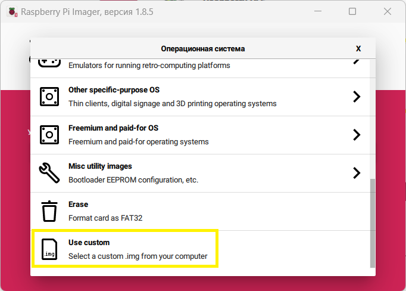

# Raspberry Pi

Видео по [обновлению образа операционной системы робота TurtleBro](https://youtu.be/OGzLALB51Pc)

Компьютеры Raspberry, идущие в комплекте с роботами, поставляются с предустановленными ОС `Raspberry Pi OS lite` ([https://www.raspberrypi.org/downloads/raspbian/](https://www.raspberrypi.org/downloads/raspbian/)) , `ROS Noetic` и всеми необходимыми системными пакетами.

Обновление образа ОС возможно через скачивание и полную перезапись microSD карты. Для работы необходима карта размером не менее **16 Gb.**

Образ можно использовать для следующей модели Raspberry:

* Raspberry 4
* Raspberry 5

### Образы операционной системы

* Последний _актуальный_ образ можно скачать по ссылке: [https://disk.yandex.ru/d/gYR7yxC3uQ\_yMA](https://disk.yandex.ru/d/gYR7yxC3uQ\_yMA)
* Все доступные образы можно найти Яндекс.Диске: [https://disk.yandex.ru/d/mtfTZb0o-Ae3uw](https://disk.yandex.ru/d/mtfTZb0o-Ae3uw)

Рекомендуем выбирать самую последнюю версию!

### Загрузка образа ОС на SD-карту без настроек

Проще всего загрузить образ на SD карту с помощью программы balenaEtcher [https://www.balena.io/etcher/](https://www.balena.io/etcher/) \
Программа обладает поддержкой всех основных операционных систем.

По умолчанию, имя робота установлено `turtlebro01`. Рекомендуется сразу изменить его на имя согласно номера платы `turtlebroNN`. Для этого необходимо отредактировать файлы, которые находятся в **разделе** `system` в папке `/etc`:`/hosts` и`/hostname` , расположенные на роботе и переименовать `turtlebro01->tutlebroNN`. Удобнее всего это сделать на компьютере с ОС Linux подключив SD карту или уже на включенном роботе, а потом перезагрузить его.

Версию образа можно посмотреть в **разделе** `system` в `/boot/version` на microSD карте.

### Загрузка образа ОС на SD-карту с дополнительными настройками

* Скачайте и установите программу для записи ОС для Raspberry Pi - Raspberry Pi Imager: [https://www.raspberrypi.com/software/](https://www.raspberrypi.com/software/)
* Запустите Raspberry Pi Imager:

<figure><figcaption>
Главное окно Raspberry Pi Imager
</figcaption></figure>

* Выберите устройство Raspberry Pi - Raspberry Pi 4:

<figure><figcaption>
Выбрать Raspberry Pi 4
</figcaption></figure>

* В окне выбора ОС перейдите в самый низ и выберите Use custom

<figure><figcaption>
Выберите Use custom
</figcaption></figure>

* Далее выберите образ ОС, который вы хотите записать на microSD:

<figure><figcaption></figcaption></figure>

* Подключите microSD карту к ноутбуку и выберите её как устройство, на которое будет записана ОС:

<figure><figcaption></figcaption></figure>

* Если все настройки сделаны верно, то главный экран программы должен выглядеть вот так:

<figure><figcaption></figcaption></figure>

* Нажмите "Далее" и выберите "Изменить параметры":

<figure><figcaption></figcaption></figure>

* Далее, во вкладке "Общие", вы сможете установить необходимые вам настройки образа ОС такие как:
  * Имя хоста. Мы рекомендуем устанавливать имя хоста: `turtlebroNN`, где NN - номер робота на наклейке
  * Имя пользователя и пароль. Рекомендуем указывать имя робота: `pi;` пароль- `brobro`
  * Настройки Wi-Fi. Здесь вы можете указать настройки своей сети. По умолчанию мы рекомендуем использовать роутеры со следующими параметрами:&#x20;
    * SSID: TurtleBro или TurtleBro5G
    * Пароль: turtlew001

<figure><figcaption>
Экран параметров "Общие"
</figcaption></figure>

* Во вкладке "Службы" необходимо включить протокол SSH:

<figure><figcaption>
Экран параметров "Службы"
</figcaption></figure>

* Во вкладке "Параметры" установите следующие настройки:

<figure><figcaption>
Экран параметров "Параметры"
</figcaption></figure>

* Примените заданные параметры нажатием "Да"

<figure><figcaption>
Нажмите "Да"
</figcaption></figure>

* Согласитесь с форматированием запоминающего устройства:

<figure><figcaption>
Нажмите "Да"
</figcaption></figure>

* Дождитесь записи ОС на microSD:

<figure><figcaption></figcaption></figure>

* После окончания процесса записи, отключите microSD карту от ноутбука, вставьте её в Raspberry Pi робота TurtleBro и включите его. Обратите внимание, что первая загрузка робота может длиться дольше обычного (1.5 - 2 минуты). Если вы сделали всё правильно, то робот подключится к вашей сети с теми именами пользователя и хоста, которые вы указывали в вкладке "Общее" окна настроек.

### Установленное ПО на SD карту

На карте установлены основные необходимые **ROS** пакеты:

`rosinstall_generator, actionlib, actionlib_msgs, amcl, angles, base_local_planner, bond, bondcpp, camera_calibration_parsers, camera_info_manager, carrot_planner, catkin, class_loader, clear_costmap_recovery, cmake_modules, costmap_2d, cpp_common, cpp_package_demo, cv_bridge, cv_camera, diagnostic_msgs, dwa_local_planner, dynamic_reconfigure, fake_localization, gencpp, geneus, genlisp, genmsg, gennodejs, genpy, geometry_msgs, global_planner, gmapping, image_transport, joint_state_publisher, kdl_parser, laser_geometry, map_msgs, map_server, message_filters, message_generation, message_runtime, mk, move_base, move_base_msgs, move_slow_and_clear, nav_core, nav_msgs, navfn, nodelet, openslam_gmapping, orocos_kdl, pluginlib, python_orocos_kdl, python_qt_binding, robot_state_publisher, ros_environment, rosapi, rosauth, rosbag, rosbag_migration_rule, rosbag_storage, rosbash, rosboost_cfg, rosbridge_library, rosbridge_msgs, rosbridge_server, rosbuild, rosclean, rosconsole, rosconsole_bridge, roscpp, roscpp_serialization, roscpp_traits, roscpp_tutorials, roscreate, rosgraph, rosgraph_msgs, roslang, roslaunch, roslib, roslint, roslisp, roslz4, rosmake, rosmaster, rosmsg, rosnode, rosout, rospack, rosparam, rospy, rospy_tutorials, rosserial_arduino, rosserial_client, rosserial_msgs, rosserial_python, rosservice, rostest, rostime, rostopic, rosunit, roswtf, rotate_recovery, rplidar_ros, sensor_msgs, smclib, std_msgs, std_srvs, stereo_msgs, tf, tf2, tf2_geometry_msgs, tf2_kdl, tf2_msgs, tf2_py, tf2_ros, tf2_sensor_msgs, topic_tools, trajectory_msgs, urdf, urdf_parser_plugin, uvc_camera, visualization_msgs, voxel_grid, xmlrpcpp`

Также установлены пакеты для функционирования робота:&#x20;

`turtlebro`\
`turtlebro_extra`\
`turtlebro_navigation`\
`turtlebro_web`
