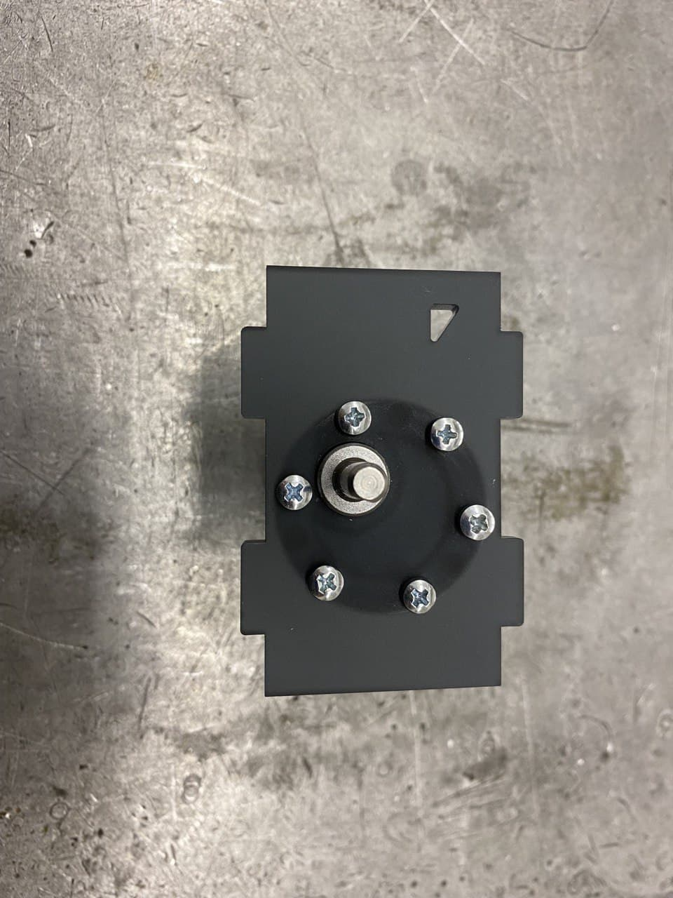

# Обновление колесной базы

В рамках обновления робота TurtleBro были подобраны новые моторы с энкодерами, которые отличаются большей надежностью по сравнению с моторами старого образца и имеют улучшенные характеристики.&#x20;

.jpg>)

В связи с увеличением типоразмера новых моторов необходимо пересобрать колесную базу робота.

### Разбор колесной базы со старыми моторами

Для разбора колесной базы со старыми моторами необходимо:

1. Отключить робота от питания, вытащить аккумуляторную батарею

2\. Отключить кабели моторов и провода питания от платы TurtleBoard, а также usb-кабель подключения камеры от Rasberry Pi

.jpg>)

3\. Используя крестовую отвёртку открутить 6 винтов _**М3х8**_ c верхней части робота и снять плату TurtleBoard

.jpg>)

.jpg>)

4\. Используя крестовую отвёртку открутить 6 винтов _**М3х8**_ с верхней части основания колесной базы

.jpg>)

5\. Отсоединить кронштейны крепления моторов и переднюю панель от нижней части колесной базы

6\. Используя крестовую отвёртку открутить 6 винтов _**М3х8**_ c нижней части колесной базы и снять 6 монтажных стоек _**М3х35**_

.jpg>)

.jpg>)

### Сборка колесной базы с новыми моторами

Используемые элементы:

* Мотор - 2 шт.;
* Кабель подключения мотора к плате TurtleBoard - 2 шт.;
* Боковые кронштейны для крепления мотора - 2 шт.;
* Передний кронштейн - 1 шт.;
* Монтажные стойки _**М3х40**_ - 6 шт.;
* Винты _**М3х8**_ - 18 шт.;
* Винты _**М3х10**_ - 12 шт.;
* Винты _**М4х8** -_ 6 шт.;
* Муфты для крепления колес, диаметр вала 6 мм. - 2 шт.;
* Колесо - 2 шт.;
* Крестовая отвертка - 1 шт.;
* Шлицовая отвертка - 1 шт.

.jpg>)

Для сбора колесной базы с новыми моторами необходимо:

1. Собрать кронштейн для крепления мотора с левой стороны робота, используя 6 винтов _**М3х10**_, в соответствии с рисунком:&#x20;

.jpg>)

2\. Собрать кронштейн для крепления мотора с правой стороны робота, используя 6 винтов _**М3х10**_, в соответствии с рисунком:

3\. К нижней части колесной базы прикрутить 6 монтажных стоек _**М3х40**_ используя 6 винтов _**М3х8**_

4\. Присоединить к мотору кабель подключения. Учтите, что кабель имеет два разных типа коннекторов:&#x20;

* 6-ти пиновый с шагом 2 мм - для подключения к плате TurtleBoard
* 6-ти пиновый с шагом 2.5 мм - для подключения к мотору

5\. Установить на нижнюю часть колесной базы кронштейны крепления моторов и переднюю панель

Обратите внимание, при монтаже кронштейна крепления левого мотора "направляющий треугольник" на кронштейне должен находиться в правом верхнем углу, а для кронштейна крепления правого мотора "направляющий треугольник" должен находиться в левом верхнем углу, как показано на рисунке:

6\. Установить верхнюю часть колесной базы и прикрутить её к монтажным стойками используя 6 винтов _**М3х8**_

7\. На вал мотора установить муфту для крепления колес и колесо, используя 3 винта _**М4х8**_

8\. Смонтировать плату Turtleboard на верхнюю часть колесной базы используя 6 винтов _**М3х8**_

.jpg>)

&#x20;9\. Подключить кабели моторов и провода питания от платы TurtleBoard, а также usb-кабель подключения камеры от Rasberry Pi


В случае, если после включения робота, моторы при тестировании проезда вперёд вращаются назад (и наоборот), необходимо проверить две вещи:\
1\. Правильно ли вы подключили кабели подключения моторов (правый мотор к правому порту подключения, левый мотор к левому порту подключению);\
2\. На DIP-переключателе, на плате TurtleBoard, переключатель № 2 должен быть установлен в положение ON

