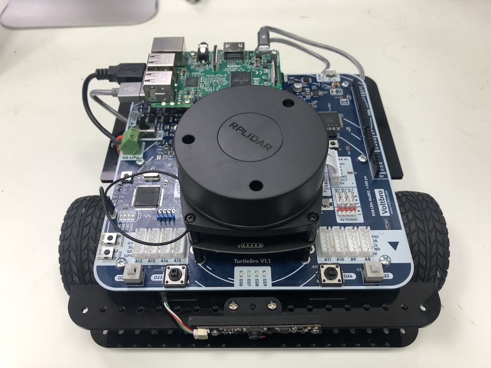

# Сборка робота

В учебные учреждения робот поставляется в собранном виде. Для включения робота необходимо подать питание на разъем "DC IN" или подключить заряженный аккумулятор, а затем перевести переключатель питания в положение ON.

### Вид собранного робота

### Аккумуляторный блок

Блок аккумуляторов состоит из 4 аккумуляторов типа 18650. Установку аккумуляторов необходимо производить согласно полюсов изображенных на плате блока.

При выборе аккумуляторов необходимо проверить что напряжение каждого аккумулятора не должно отличать на более чем 0.2 вольта относительно друг друга. Если аккумулятор превышает заданное отклонение, необходимо провести перебалансировку всего блока.

При этом минимальное и максимальное напряжение должно быть в интервала от 2.6В до 4.2В

