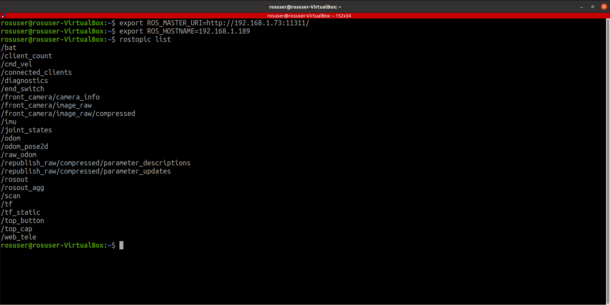

# Подключение к ROS на роботе

### Подключение к роботу по сети из ROS

На компьютере необходимо указать, по какому адреcу находится ROS-мастер `roscore`. Для этого на компьютере в терминале необходимо установить переменную окружения `ROS_MASTER_URI`:

```
export ROS_MASTER_URI=http://192.168.0.250:11311/
```

Где `192.168.0.250` - это **IP-адрес робота**.

Для правильной работы сети, также необходимо установить на компьютере в терминале переменную ROS\_HOSTNAME:

```
export ROS_HOSTNAME=192.168.0.100
```

Где `192.168.0.100` - это **IP-адрес вашего компьютера**.

Удобно прописать `ROS_MASTER_URI` и `ROS_HOSTNAME`в файле `.bashrc`, для того чтобы каждый раз не делать `export`. Для этого необходимо открыть в текстовом редакторе файл `~/.bashrc` и в самый конец добавить строчки:

```
export ROS_MASTER_URI=http://<IP-адрес робота>:11311/
export ROS_HOSTNAME=<IP-адрес компьютера>
```

Аналогичные настройки `ROS_MASTER_URI` и `ROS_HOSTNAME` применены на роботе через файл `.bashrc`.

Если все настройки проведены верно, вы можете выполнить на вашем компьютере команды ROS и увидеть результат их выполнения:

<figure><figcaption></figcaption></figure>
