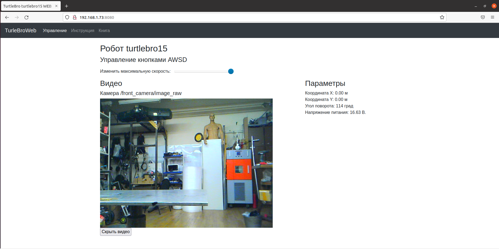

# Веб-интерфейс

Для начала работы с роботом вы можете зайти на веб-сервер запущенный на роботе `http://<IP-адрес робота>:8080` (указав IP адрес вашего робота)

На этой странице будут доступны основные данные робота и изображение получаемое из камеры:

<figure><figcaption></figcaption></figure>

Роботом можно управлять кнопками **WSAD**.&#x20;
