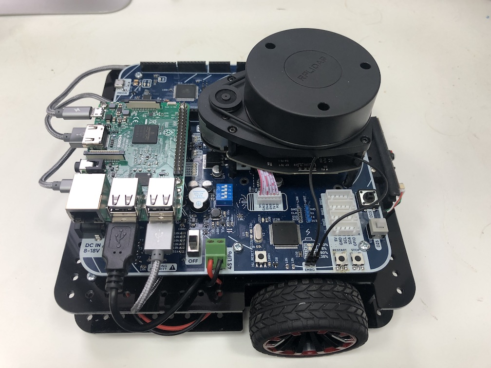

# Сборка робота

В учебные учереждения робот поставляеться в собранном виде. Для включения робота, необходимо подключить питание через DC разьем или подключить аккумулятор. Включить переключатель питания в положение ON.

### Вид собранного робота

