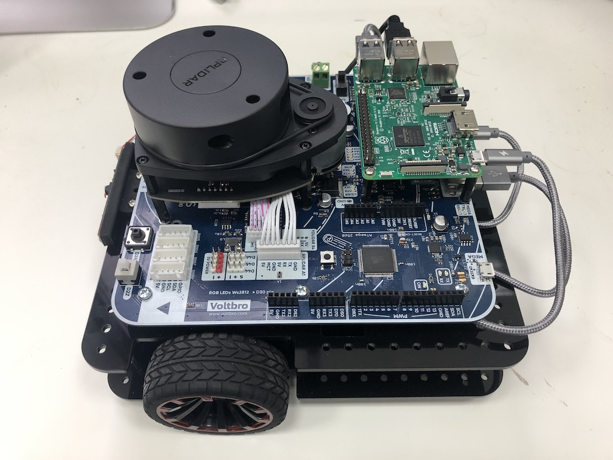

# Сборка робота

В учебные учреждения робот поставляется в собранном виде. Для включения робота необходимо подать питание на разьем "DC IN" или подключить заряженный аккумулятор, а затем перевести переключатель питания в положение ON.

### Вид собранного робота

