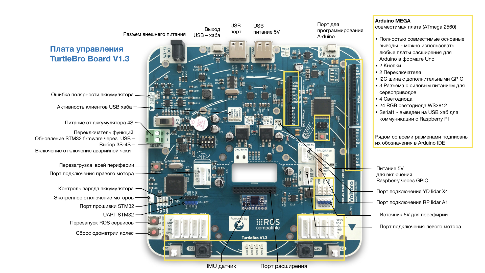
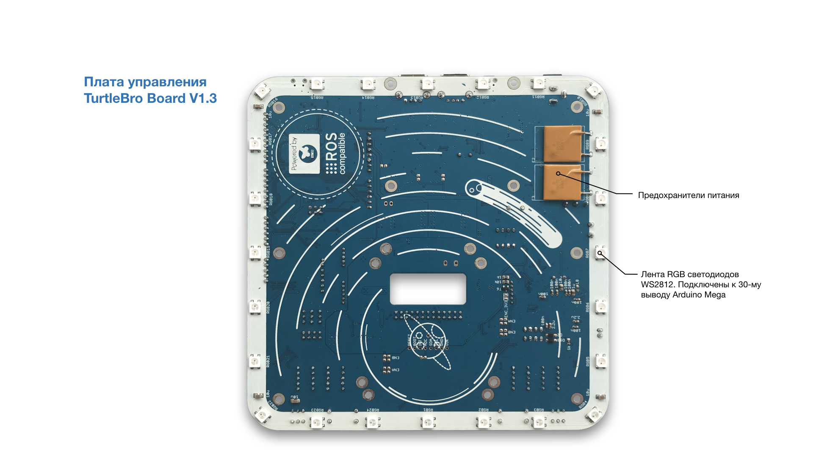

# Системная плата

## Схема платы

### Назначение кнопок на плате

`restart` Нажатие кнопки перезапускает программу МК STM32. Происходит чтение rosparams, сбрасываются значения датчика IMU, одометрии, текущих скоростей колес. Кнопку необходимо использовать при изменении rosparams на стороне raspberry. Перезапуск идет около 30 секунд.

`stop` При нажатии сбрасывается значение cmd\_vel (робот останавливается), обнуляются значения одометрии и IMU датчика. Удобно пользоваться этой кнопкой для установки нулевого положения робота на полигоне.

`hw_reset` Кнопка сброса МК STM32. Осуществляет полный перезапуск робота, включая Raspberry.

`reset` Кнопка сброса Arduino. Осуществляет полный перезапуск Arduino.

`EMRG` Выходы для подключения чеки экстренной остановки моторов. Для работы в нормальном режиме контакты должны быть замкнуты.

