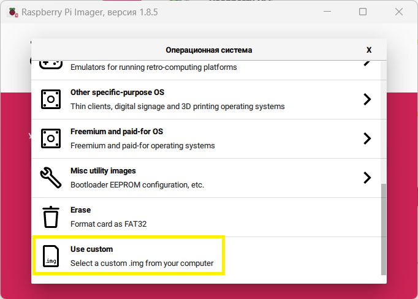
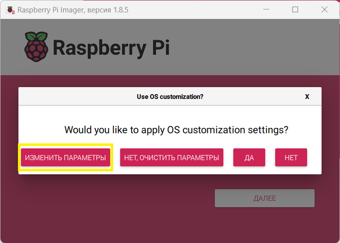
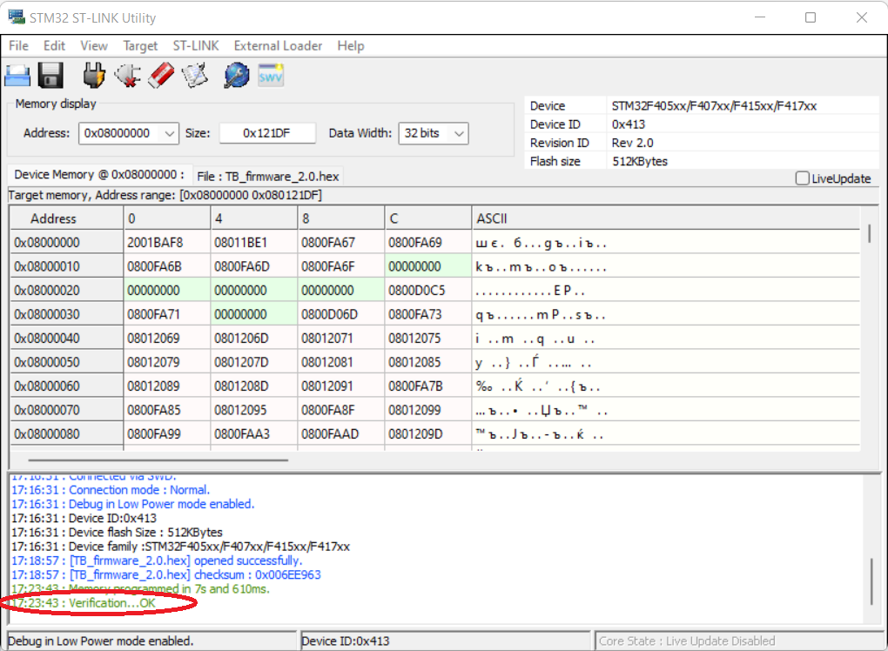
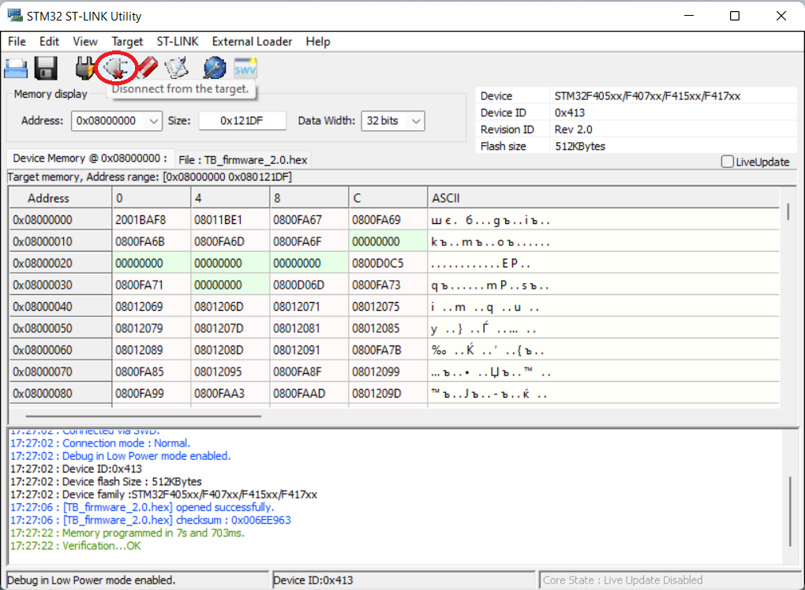

# Обновление микропрограммы с помощью программатора ST-LINK V2

Для обновления микропрограммы системной платы TurtleBoard необходимо использовать программу [STM32 ST-LINK Utility](https://disk.yandex.ru/d/10Y7USIAVKn5mQ).&#x20;

Придерживайтесь следующей инструкции:

* Выключите питание робота и извлеките из него батарею.&#x20;
* Подсоедините программатор ST-LINK V2 к разъему ST-LINK чёрного цвета на системной плате. Обратите внимание на то, что ножка SWDIO программатора должна быть соединена с ножкой DIO разъема ST-LINK, а ножка SWCLK программатора - к CLK разъема ST-LINK.&#x20;


Ножка 3V3 разъема ST-LINK может быть подключена только к источнику напряжения 3.3В! Подключение ее к 5В может привести к повреждению платы!


* Подключите ST-LINK V2 к компьютеру, он должен определиться системой как Устройство USB: STM32 STLink.
* Запустите программу STM32 ST-LINK Utility. Нажмите кнопку Connect to the target.

.png>)

* После соединения вы должны увидеть приблизительно следующее:


Если вы этого не увидели - проверьте правильность выполнения предыдущих шагов и попробуйте еще раз


* Далее необходимо перейти в меню Target и выбрать пункт Program & Verify... :

* Выберите необходимый [файл прошивки](https://disk.yandex.ru/d/eov3wiMFHE8zFw) с расширением .hex, скачанный с нашего сайта:

.png>)

* Произведите необходимые настройки согласно изображению ниже и нажмите кнопку Start:

.png>)

* После нажатия кнопки Start должен начаться процесс обновления микропрограммы. Он может занять несколько минут, пожалуйста, дождитесь его окончания. После окончания загрузки вы должны увидеть следующее сообщение:

* Нажмите кнопку Disconnect from the target:

* Закройте программу
* Отключите программатор ST-LINK V2 от компьютера
* Отсоедините программатор ST-LINK V2 от платы TurtleBoard


При следующей запуске робот будет использовать обновленную микропрограмму

